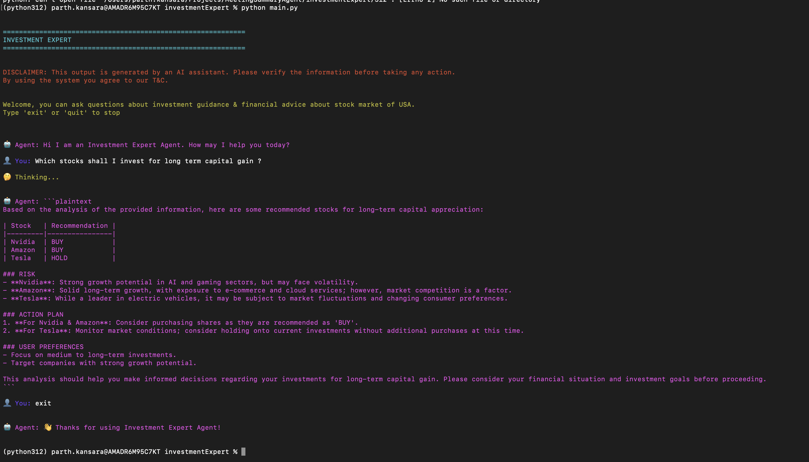

## Prerequisites

- Python 3.12
- OpenAI API Key ([Get one here](https://platform.openai.com/api-keys))
- Windows PowerShell or Git Bash (for commands below)

## Quick Start

1. Create Postgres Vector DB using podman [[Download podman desktop](https://podman-desktop.io/docs/installation/windows-install)].
    ```
    podman run -d \
    --name pgvector-db \
    -e POSTGRES_USER=postgres \
    -e POSTGRES_PASSWORD=postgres \
    -e POSTGRES_DB=vectordb \
    -p 5432:5432 \
    docker.io/pgvector/pgvector:pg16
    ```

2. Create a document table in DB which can store vector DB.
    ```
    CREATE TABLE documents (
        id SERIAL PRIMARY KEY,
        content TEXT,
        embedding VECTOR(1536),  -- Adjust dimension to match your embedding model
        doc_name VARCHAR(255)
    );
    ```
2. Navigate to Project root folder.
3. Open "cmd" / "terminal"
4. Create virtual enviornment: `python -m venv venv`
5. Activate virtual enviornment: `venv\Scripts\activate`
6. Install dependencies: `pip install -r requirements.txt`
7. Setup enviornment variables: `cp .env.example .env`
8. Run program to populate VectorDB: `python ingest.py` 
8. Run program: `python main.py`

## Project Structure

```text
investmentExpert
├── main.py
├── graph.py
├── constants.py
├── ingest.py
├── agents
│   ├── supervisor.py
│   ├── investment_advisor.py      #RAG Agent
│   └── aggregator.py
├── config
│   ├── db_config.py
│   └── llm_config.py
│   └── custom_printer.py
└── assets
    ├── investment.md                   #Fake Data
    └── equity_stocks_investment.md     #Fake Data
```

- **`main.py`** – entry point orchestrating the agents.
- **`ingest.py`** - most important to populate Postgres VectorDB with embeddings.
- **`agents/`** – core agent modules, each implements a different role/task. architecture for multi-agent system.
- **`graph.py`** – configuration for `langgraph` & `AgentState`.
- **`.env.example`** – environment variable template.
- **`requirements.txt`** – Python dependencies.
- **`assets/`** – sample document data for RAG. 

## Working example

Ask a question to agent like below:

`👤 You: what are the key financial indicators for my investment?`



## Technical Explanation

- The project uses basic chunking strategic of `Fixed size chunking with overlap`.
- Recommended model for chunking is `text-embedding-3-small`.
- Model used for chatbot is as follow `gpt-4o-mini` which is good enough to hold the context window for replying the question from RAG (PGVector) database. 
- The system is designed so it can be expanded by adding more agents without changing the high-level architecture. 

## License

[MIT](./LICENSE) License © 2026-PRESENT [Parth Kansara](https://github.com/kparth01)
